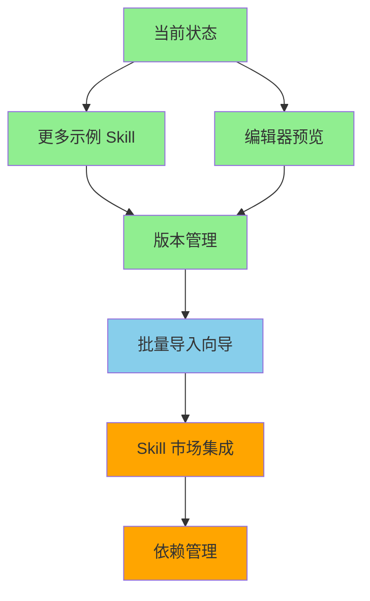

# Skills Manager 改进计划

> 参考 [Product Manager Skills](https://github.com/deanpeters/Product-Manager-Skills)
> 项目的优秀实践，记录可借鉴的改进方向和实施方案。

**状态说明**：

- ✅ 已完成
- 🔄 进行中
- ⏳ 待实施

---

## 一、扩展 IR 和 Parser：支持 `intent` 字段和语义类型 ✅

### 1.1 背景

Product Manager Skills 的 SKILL.md frontmatter 包含：

- `intent` — 详细意图说明，回答"这个 skill 要解决什么问题"
- `type` — 语义类型：`component`（模板/制品）、`interactive`（引导式对话）、`workflow`（端到端流程）

我们当前的 IR 缺少 `intent`，`type` 只是通用字符串，没有语义约束。

### 1.2 实施方案

#### 修改 `src/skills_manager/ir.py`

```python
@dataclass
class SkillIR:
    name: str
    version: str
    description: str
    summary: str
    type: str                    # 保留兼容
    skill_type: str = ""         # 新增：component | interactive | workflow
    intent: str = ""             # 新增：详细意图说明
    tags: list[str] = field(default_factory=list)
    category: str = ""
    # ... 其他字段
```

#### 修改 `src/skills_manager/parser.py`

在 `_parse_frontmatter()` 中提取 `intent` 和 `skill_type`：

```python
ir.intent = fm.get("intent", "")
ir.skill_type = fm.get("type", "")  # 优先用 type 字段
```

#### 验证

- 更新测试用例，覆盖 `intent` 和 `skill_type` 字段
- 确保现有 SKILL.md 无字段时向后兼容（默认空字符串）

---

## 二、添加 Skill 格式验证器 ✅

### 2.1 背景

Product Manager Skills 有 `scripts/validate-skills.sh` 验证 SKILL.md 格式。
我们需要在安装前检查格式是否合规，避免无效 skill 进入 store。

### 2.2 实施方案

#### 新建 `src/skills_manager/validator.py`

```python
@dataclass
class ValidationResult:
    valid: bool
    errors: list[str]      # 必须修复
    warnings: list[str]    # 建议修复

def validate_skill_dir(path: Path) -> ValidationResult:
    """验证 skill 目录是否合规。"""
    ...

def validate_skill_md(content: str) -> ValidationResult:
    """验证 SKILL.md 内容是否合规。"""
    ...
```

#### 验证规则

| 检查项 | 级别 | 说明 |
| ------ | ---- | ---- |
| SKILL.md 存在 | 错误 | 必须有 SKILL.md |
| frontmatter 有效 | 错误 | 必须是合法 YAML |
| `name` 字段存在 | 错误 | 必填 |
| `name` 长度 ≤ 64 | 警告 | Claude Desktop 兼容性 |
| `description` 存在 | 错误 | 必填 |
| `description` 长度 ≤ 200 | 警告 | Claude Desktop 兼容性 |
| 目录名与 `name` 一致 | 警告 | 命名规范 |
| `type` 值合法 | 警告 | 应为 component/interactive/workflow |

#### 集成到 Store

在 `Store.install()` 开头调用验证：

```python
def install(self, source, name=None, force=False):
    result = validate_skill_dir(source)
    if not result.valid:
        raise StoreError(f"验证失败: {'; '.join(result.errors)}")
    # ... 继续安装
```

#### 集成到桌面客户端

在安装对话框中显示验证结果，让用户确认是否继续（warnings 不阻止安装）。

---

## 三、Catalog 视图：按语义类型筛选 ✅

### 3.1 背景

Product Manager Skills 有 `skills-index.yaml` 和 `skills-by-type.md` 两种索引视图。我们的浏览页只有关键词搜索，缺少按类型分类的能力。

### 3.2 实施方案

#### 扩展 Store 索引

在 `index.json` 的每个 skill 条目中增加 `skill_type` 字段（从 IR 同步）。

#### 修改浏览页 `desktop/pages/browse.py`

在搜索栏下方增加类型筛选芯片：

```python
ft.Row([
    ft.Chip(label=ft.Text("全部"), selected=...),
    ft.Chip(label=ft.Text("模板"), selected=...),      # component
    ft.Chip(label=ft.Text("对话"), selected=...),      # interactive
    ft.Chip(label=ft.Text("流程"), selected=...),      # workflow
])
```

#### 修改 `Store.search()`

增加 `skill_type` 过滤参数：

```python
def search(self, query, tag=None, category=None, skill_type=None):
    ...
    if skill_type and skill.skill_type != skill_type:
        continue
    ...
```

---

## 四、CLAUDE.md 生成 ✅

### 4.1 背景

Product Manager Skills 的 `CLAUDE.md` 和 `AGENTS.md` 指导 agent 如何与项目协作。
我们可以更进一步：安装 skill 后自动生成或更新 agent 目录中的 CLAUDE.md，
让 agent 知道有哪些 skill 可用。

### 4.2 实施方案

#### 新建 `src/skills_manager/agent_config.py`

```python
def generate_claude_md(skills: list[dict]) -> str:
    """生成 CLAUDE.md 内容，列出所有可用 skill。"""
    ...

def update_agent_claude_md(agent_dir: Path, skills: list[dict]) -> None:
    """更新 agent 目录中的 CLAUDE.md。"""
    ...
```

#### 生成模板

```markdown
# Skills Manager — Agent 配置

以下 skill 已安装并可用：

| 名称 | 类型 | 描述 |
| ---- | ---- | ---- |
| translator | component | 翻译工具 |
| ... | ... | ... |

使用方式：在对话中引用 skill 名称即可。
```

#### 集成到同步流程

在 `Store.sync_skill_to_agents()` 中，同步完 skill 后自动更新该 agent 目录的 CLAUDE.md。

#### 设置页开关

在设置页增加"自动生成 CLAUDE.md"开关，让用户控制是否启用。

---

## 五、打包功能：导出为平台特定格式 ✅

### 5.1 背景

Product Manager Skills 支持导出为 Claude Desktop pack、Codex pack 等格式。
我们可以参考，让用户一键打包 skill 为特定平台的安装包。

### 5.2 实施方案

#### 扩展 `src/skills_manager/packager.py`

```python
def pack_for_claude_desktop(skills: list[str], output_dir: Path) -> Path:
    """打包为 Claude Desktop 格式（ZIP，含 Skill.md 副本）。"""
    ...

def pack_for_codex(skills: list[str], output_dir: Path) -> Path:
    """打包为 Codex 格式（含 AGENTS.md 和 .agents/skills/ 结构）。"""
    ...

def pack_for_claude_code(skills: list[str], output_dir: Path) -> Path:
    """打包为 Claude Code 格式（.claude/skills/ 结构）。"""
    ...
```

#### 集成到批量导出页

在 `desktop/pages/export.py` 中增加"打包格式"下拉：

- 原始导出（当前功能）
- Claude Desktop Pack
- Codex Pack
- Claude Code Pack

#### 集成到 CLI

```bash
skills-manager pack --format claude-desktop --output ./dist skill1 skill2
```

---

## 六、优先级排序

| 优先级 | 改进项 | 工作量 | 价值 | 依赖 | 状态 |
| ------ | ------ | ------ | ---- | ---- | ---- |
| P0 | IR 扩展（intent + skill_type） | 小 | 基础，后续依赖 | 无 | ✅ |
| P0 | 格式验证器 | 小 | 安装质量保障 | 无 | ✅ |
| P1 | Catalog 视图（按类型筛选） | 中 | 浏览体验提升 | P0 IR 扩展 | ✅ |
| P1 | CLAUDE.md 生成 | 中 | agent 集成体验 | P0 IR 扩展 | ✅ |
| P2 | 打包功能 | 大 | 多平台分发 | P0 IR 扩展 | ✅ |
| P3 | 测试覆盖率提升 | 中 | 质量保障 | 无 | ✅ |
| P3 | CLI 集成测试 | 中 | 命令行可靠性 | 无 | ✅ |
| P4 | 编辑器增强 | 大 | 用户体验 | 无 | ✅ |
| P4 | 更多示例 Skill | 小 | 文档和演示 | 无 | ✅ |

建议实施顺序：P0 → P1 → P2，每完成一个即可独立发布。

---

## 七、测试改进 ✅

### 7.1 背景

初始测试覆盖率 68%，store.py 仅 63%，cli.py 为 0%。需要提升测试质量以确保可靠性。

### 7.2 实施结果

- **测试数量**：100 → 144（+44 个新测试）
- **总体覆盖率**：68% → 92%（+24%）
- **store.py**：63% → 91%（+28%）
- **cli.py**：0% → 92%（+92%）

### 7.3 新增测试内容

**Store 测试（+16 个）：**

- `install_from_package()` - 从 .skill 包安装
- `discover_in_paths()` - 自动发现功能
- `scan_directory()` - 递归扫描目录
- `scan_and_install()` - 批量扫描安装
- 监视路径管理（get/add/remove）
- 错误情况处理

**CLI 测试（+28 个）：**

- 基本命令：`--help`, `--version`
- 安装/卸载命令
- 列表/详情命令
- 搜索命令（关键词、分类、标签）
- 导出命令（单个、批量、格式验证）
- 打包命令
- 环境检查命令

---

## 八、示例 Skill 更新 ✅

### 8.1 改进内容

为所有示例 Skill 添加 `skill_type` 和 `intent` 字段：

| Skill | skill_type | intent |
| ----- | ---------- | ------ |
| translator | component | 将文本翻译到指定目标语言，保持术语一致性 |
| json-formatter | component | 对 JSON 字符串进行格式化、压缩或语法校验 |
| code-reviewer | component | 对代码进行审查，检测 bug、性能和安全问题 |

### 8.2 验证结果

类型筛选功能正常工作：

- `component` 类型：3 个结果
- `workflow` 类型：0 个结果
- `interactive` 类型：0 个结果

---

## 九、下一步发展方向

### 9.1 短期目标（1-2 周）

#### 更多示例 Skill ✅

**目标**：补充 `interactive` 和 `workflow` 类型的示例，展示完整的 Skill 类型体系。

**已添加**：

| 名称 | 类型 | 说明 |
| ---- | ---- | ---- |
| interview-prep | interactive | 面试准备引导（多轮问答） |
| deploy-pipeline | workflow | 部署流程编排（多阶段） |
| code-generator | component | 代码模板生成 |

**验证结果**：

- 类型筛选功能正常：component 4 个、interactive 1 个、workflow 1 个
- 所有示例通过格式验证

#### 编辑器基础预览 ✅

**目标**：在编辑 SKILL.md 时，实时预览导出效果。

**实施方案**：

- 在 `desktop/pages/editor.py` 添加预览面板
- 解析当前内容 → 调用 adapter.export() → 显示结果
- 支持切换预览格式（OpenAI/Claude/Gemini/MCP/Schema）

**已实现功能**：

- 左右分栏布局：左侧表单、右侧预览
- 表单字段：名称、版本、描述、语义类型、意图说明、分类、标签
- 实时预览：表单变化时自动更新预览内容
- 格式切换：SKILL.md / OpenAI / Claude / Gemini / MCP / JSON Schema
- 生成 SKILL.md 骨架并保存安装

**工作量**：中（约 2-3 天）

**价值**：高（提升编辑体验，即时验证格式）

### 9.2 中期目标（1 个月）

#### 版本管理功能 ✅

**目标**：支持 Skill 版本升级和回滚。

**已实现功能**：

- 安装时自动记录版本历史（`.version_history.json`）
- 升级时创建版本快照（`.versions/` 目录），支持回滚
- CLI 命令：`skills-manager upgrade <name> <source>` 升级到新版本
- CLI 命令：`skills-manager rollback <name> [version]` 回滚到指定版本
- CLI 命令：`skills-manager history <name>` 查看版本历史
- 升级前自动备份当前版本，保留完整快照
- 回滚时支持指定版本号，默认回滚到上一个版本

**工作量**：中（约 1 周）

**价值**：高（生产环境必备）

#### 批量导入向导 ✅

**目标**：从目录批量导入多个 Skill。

**已实现功能**：

- 桌面应用新增"批量导入"页面
- 选择目录 → 扫描所有 SKILL.md → 显示详细列表
- 支持全选/单选，已安装 Skill 标记 `[已安装]`
- 批量导入选中 Skill，显示导入结果
- 新增 `Store.scan_directory_with_info()` 方法

**工作量**：小（约 2 天）

**价值**：中（提升批量操作效率）

### 9.3 长期目标（3 个月+）

#### Skill 市场集成 ⏳

**目标**：连接在线 Skill 市场，实现 Skill 的发现和共享。

**核心功能**：

- 浏览在线 Skill 市场
- 一键安装市场中的 Skill
- 发布本地 Skill 到市场
- 评分和评论系统

**工作量**：大（约 1 个月）

**价值**：高（构建生态系统）

#### 依赖管理 ⏳

**目标**：支持 Skill 之间的依赖关系。

**核心功能**：

- 在 SKILL.md 中声明依赖
- 安装时自动解析和安装依赖
- 循环依赖检测
- 版本兼容性检查

**工作量**：大（约 2 周）

**价值**：中（支持复杂 Skill 组合）

### 9.4 技术债务

| 项目 | 优先级 | 说明 |
| ---- | ---- | ---- |
| XSS 防护 | 中 | name 字段输入清理，防止潜在注入 |
| 错误处理统一 | 低 | 部分模块错误处理风格不一致 |
| 日志系统 | 低 | 添加结构化日志，便于调试 |
| 国际化支持 | 低 | CLI 和桌面应用的多语言支持 |

### 9.5 推荐实施路径



**建议优先级**：

1. **已完成**：更多示例 Skill、编辑器预览、版本管理、批量导入向导
2. **下一步**：浏览体验优化（提升发现和使用效率）
3. **一个月后**：Skill 市场集成（构建生态系统）
4. **长期目标**：依赖管理（支持复杂 Skill 组合）

---

## 十、浏览体验优化 ✅

> 参考 TRAE SOLO marketplace 的设计理念，优化 Skill 浏览和发现体验。

### 10.1 当前状态

现有浏览功能：

- 搜索栏（名称、描述、标签）
- 分类筛选（8 个分类）
- 类型筛选（模板、对话、流程）
- 卡片网格展示（名称、版本、描述）

### 10.2 优化方向

#### 卡片信息增强 ✅

**目标**：卡片展示更丰富的信息，帮助用户快速判断。

**改进点**：

- 显示来源标识（本地 / URL / GitHub）
- 显示安装时间（"2 天前安装"）
- 显示标签（最多 3 个，超出显示 "+N"）
- 显示 Skill 类型图标（component / interactive / workflow）
- 卡片悬浮时显示更多信息（参数数量、导出格式支持）

**参考**：TRAE SOLO 的卡片设计，信息密度适中，视觉层次清晰。

#### 排序功能 ✅

**目标**：支持多种排序方式，满足不同场景需求。

**排序选项**：

| 排序方式 | 说明 | 场景 |
| ---- | ---- | ---- |
| 名称 A-Z | 字母升序 | 快速定位 |
| 最近安装 | 按安装时间倒序 | 查看最近添加 |
| 最近使用 | 按使用时间倒序 | 查看常用 Skill |
| 版本更新 | 按版本号排序 | 检查版本状态 |

**交互**：排序控件放在搜索栏右侧，下拉选择。

#### 视图切换 ✅

**目标**：支持网格视图和列表视图切换。

**网格视图**（当前）：

- 适合浏览和发现
- 卡片式展示，视觉效果好
- 适合 Skill 数量 < 50 的场景

**列表视图**：

- 适合快速扫描
- 紧凑布局，信息密度高
- 适合 Skill 数量 > 50 的场景
- 显示更多详细信息（参数数量、导出格式、来源）

**交互**：视图切换按钮放在排序控件旁边。

#### 标签云 ✅

**目标**：可视化展示热门标签，快速筛选。

**实现方式**：

- 在分类筛选下方显示标签云区域
- 标签大小根据使用频率动态调整
- 点击标签快速筛选
- 支持多标签组合筛选（AND / OR 切换）

**参考**：TRAE SOLO 的标签设计，标签之间有层次感。

#### 最近使用 ✅

**目标**：记录用户行为，提供个性化推荐。

**功能**：

- 记录 Skill 使用时间（导出、查看、编辑）
- 浏览页顶部显示"最近使用"区域（最多 5 个）
- 支持收藏功能（星标），收藏的 Skill 优先显示
- 使用记录存储在 `.usage_history.json`

**价值**：提升常用 Skill 的访问效率。

#### 批量操作 ✅

**目标**：支持批量选择和操作。

**功能**：

- 卡片左上角添加复选框
- 全选 / 取消全选
- 批量导出（选中 → 选择格式 → 导出）
- 批量卸载（选中 → 确认 → 卸载）
- 批量打标签（选中 → 添加/移除标签）

**交互**：选中后底部显示操作栏，显示选中数量和操作按钮。

#### 空状态优化 ✅

**目标**：提升首次使用和空状态的体验。

**场景**：

| 场景 | 当前 | 优化后 |
| ---- | ---- | ---- |
| 首次启动 | 自动导入示例 | 引导式欢迎页面，介绍核心功能 |
| 搜索无结果 | 显示空状态组件 | 显示推荐 Skill 或搜索建议 |
| 筛选无结果 | 显示空列表 | 显示"清除筛选"按钮和推荐 |

#### 加载状态 ✅

**目标**：优化大量 Skill 时的加载体验。

**功能**：

- 骨架屏：卡片加载时显示占位符
- 虚拟滚动：只渲染可见区域的卡片
- 分页加载：每次加载 20 个，滚动到底部加载更多
- 搜索防抖：输入停止 300ms 后才触发搜索

### 10.3 实施优先级

| 优先级 | 功能 | 工作量 | 价值 |
| ---- | ---- | ---- | ---- |
| 高 | 卡片信息增强 | 小 | 高 |
| 高 | 排序功能 | 小 | 中 |
| 中 | 视图切换 | 中 | 中 |
| 中 | 标签云 | 中 | 中 |
| 低 | 最近使用 | 中 | 中 |
| 低 | 批量操作 | 大 | 中 |
| 低 | 空状态优化 | 小 | 低 |
| 低 | 加载状态 | 大 | 低 |

**建议实施顺序**：

1. 卡片信息增强（快速提升信息密度）
2. 排序功能（满足基本排序需求）
3. 视图切换（适应不同使用场景）
4. 标签云（提升筛选效率）
5. 最近使用（个性化体验）
6. 批量操作（提升管理效率）
7. 空状态优化（完善边缘场景）
8. 加载状态（性能优化）

---

## 十一、浏览页参考 TRAE SOLO 改进 ✅

> 参考 TRAE SOLO marketplace（`https://solo.trae.cn/marketplace`）的设计，进一步优化浏览页。

### 11.1 分区展示 ✅

**现状**：所有 Skill 平铺在一个网格中，靠分类芯片筛选。

**目标**：按分类分区块展示，每块有区块标题，形成自然的视觉层次。

**参考**：TRAE SOLO 将技能分为"开发工具"、"数据分析"、"界面设计"、"内容创作"、"效率提升"五个区块，每块有独立标题和卡片网格。

**实现方式**：

- 默认视图改为分区展示（按 category 分组）
- 保留分类芯片作为快速跳转（点击跳转到对应区块）
- 保留平铺网格视图作为切换选项

### 11.2 来源 logo ✅

**现状**：来源以文字 badge 显示（本地 / GitHub / URL）。

**目标**：显示来源方 logo 图标（如 Anthropic、Vercel、OpenAI 等）。

**参考**：TRAE SOLO 每张卡片左侧显示来源方 48x48 logo。

**实现方式**：

- 维护来源 → logo 映射表
- 本地 Skill 使用默认图标
- GitHub 来源根据 org 名称匹配 logo

### 11.3 卡片信息精简 ✅

**现状**：卡片显示名称、描述、标签、版本、分类、类型、来源、安装时间，信息密度偏高。

**目标**：精简为核心信息：名称 + 描述 + 作者/来源 + 安装按钮。

**参考**：TRAE SOLO 卡片只显示 icon + name + description + author + install button。

**实现方式**：

- 卡片默认只显示名称、描述、来源
- 标签、版本、安装时间等移到详情页或悬浮卡片
- 提供"简洁模式"和"详细模式"切换

### 11.4 已安装 badge ✅

**现状**：侧边栏显示"v0.1.0 · N 个 Skill"。

**目标**：标签栏显示已安装数量 badge。

**参考**：TRAE SOLO 的"已安装"标签旁显示数字 badge。

**实现方式**：

- 在分类芯片的"全部"标签旁显示总数
- 在类型筛选的"全部类型"旁显示总数

---

## 十二、用户体验优化 ✅

> 针对用户反馈的 5 个问题进行系统性优化。

### 12.1 性能优化 ✅

**问题**：软件响应迟缓。

**优化措施**：

| 优化项 | 文件 | 说明 |
| ---- | ---- | ---- |
| 索引缓存 | `store.py` | `_load_index()` 添加内存缓存，避免每次读磁盘 |
| 缓存失效 | `store.py` | `_save_index()` 时自动清除缓存 |
| 编辑器优化 | `editor.py` | 移除每次按键时的 `_update_ui()` 调用，改用轻量级 `page.update()` |

**效果**：减少不必要的磁盘 I/O 和全量 UI 重建，提升响应速度。

### 12.2 筛选高亮修复 ✅

**问题**：类型筛选芯片高亮状态不更新。

**根因**：`type_chips` 在页面加载时构建一次，后续筛选操作只重建卡片，不重建芯片。

**修复方案**：

- 将 `type_chips` 改为容器引用模式（`type_chips_row`）
- 添加 `_rebuild_type_chips()` 函数
- `on_type_select()` 和 `_refresh_all()` 中调用重建

**效果**：切换类型筛选时高亮状态正确更新。

### 12.3 字体规范统一 ✅

**问题**：字体显示效果不一致。

**解决方案**：

在 `components.py` 定义 7 个字体常量：

```python
FONT_TITLE = 22       # 页面标题
FONT_SUBTITLE = 13    # 副标题/统计
FONT_CARD_NAME = 14   # 卡片名称
FONT_CARD_DESC = 11   # 卡片描述
FONT_TAG = 10         # 标签
FONT_META = 11        # 元数据
FONT_SECTION = 13     # 区块标题
```

**更新范围**：

- `components.py` — 所有组件
- `browse.py` — 浏览页
- `detail.py` — 详情页
- `editor.py` — 编辑器页
- `profiles.py` — Profile 页
- `import_page.py` — 导入页

**效果**：全平台字体大小统一，视觉一致性提升。

### 12.4 UI 美化 ✅

**问题**：界面 UI 简陋，不美观。

**改进内容**：

#### 侧边栏

- 选中态图标变为 PRIMARY 色
- 选中项添加左侧指示条（3px PRIMARY 色边框）
- 选中项文字加粗
- 底部版本信息区域使用 `SURFACE_CONTAINER_HIGHEST` 背景

#### 卡片

- 添加 `elevation=2` 阴影效果
- 保持分类颜色左边框指示条

#### 详情页

- 参数表添加斑马条纹（奇偶行交替背景色）
- 导出预览区添加边框和 `SURFACE_CONTAINER_HIGHEST` 背景
- 操作按钮分主次：FilledButton（复制导出）vs OutlinedButton（保存文件）

#### 浏览页

- 分区标题使用 `FONT_SECTION` 常量
- 筛选区使用 `FONT_SECTION` 常量

**效果**：视觉层次更清晰，交互反馈更明确。

### 12.5 自动分类 ✅

**问题**：第三方 SKILL.md 若未声明 `category` 字段，则显示为"未分类"。

**解决方案**：

在 `store.py` 添加 `_infer_category()` 方法：

```python
CATEGORY_KEYWORDS = {
    "code": ["code", "program", "develop", "api", "sdk", "git", "debug", ...],
    "language": ["translat", "language", "i18n", "locale", "多语言", "翻译"],
    "data": ["data", "analy", "chart", "csv", "excel", "report", "数据", "分析"],
    "research": ["search", "research", "retriev", "query", "搜索", "研究"],
    "writing": ["write", "content", "doc", "blog", "copy", "写作", "文档"],
    "automation": ["automat", "deploy", "ci", "cd", "pipeline", "自动化", "部署"],
    "agent": ["agent", "mcp", "tool", "skill", "代理", "工具"],
}
```

**工作流程**：

1. 安装时解析 SKILL.md
2. 若 `ir.category` 为空，调用 `_infer_category(ir)`
3. 收集 name、description、summary、tags 文本
4. 统计每个分类的关键词匹配次数
5. 返回得分最高的分类

**效果**：自动为无分类的 Skill 推断分类，提升浏览体验。

### 12.6 测试验证

- **测试数量**：196 个测试全部通过
- **桌面客户端**：启动正常，无报错
