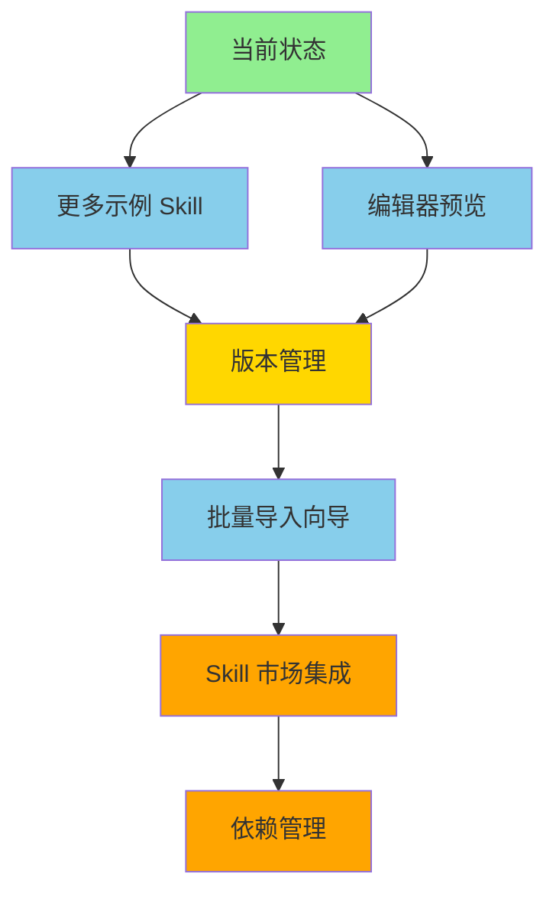

# Skills Manager 改进计划

> 参考 [Product Manager Skills](https://github.com/deanpeters/Product-Manager-Skills) 项目的优秀实践，记录可借鉴的改进方向和实施方案。

**状态说明**：

- ✅ 已完成
- 🔄 进行中
- ⏳ 待实施

---

## 一、扩展 IR 和 Parser：支持 `intent` 字段和语义类型 ✅

### 1.1 背景

Product Manager Skills 的 SKILL.md frontmatter 包含：

- `intent` — 详细意图说明，回答"这个 skill 要解决什么问题"
- `type` — 语义类型：`component`（模板/制品）、`interactive`（引导式对话）、`workflow`（端到端流程）

我们当前的 IR 缺少 `intent`，`type` 只是通用字符串，没有语义约束。

### 1.2 实施方案

#### 修改 `src/skills_manager/ir.py`

```python
@dataclass
class SkillIR:
    name: str
    version: str
    description: str
    summary: str
    type: str                    # 保留兼容
    skill_type: str = ""         # 新增：component | interactive | workflow
    intent: str = ""             # 新增：详细意图说明
    tags: list[str] = field(default_factory=list)
    category: str = ""
    # ... 其他字段
```

#### 修改 `src/skills_manager/parser.py`

在 `_parse_frontmatter()` 中提取 `intent` 和 `skill_type`：

```python
ir.intent = fm.get("intent", "")
ir.skill_type = fm.get("type", "")  # 优先用 type 字段
```

#### 验证

- 更新测试用例，覆盖 `intent` 和 `skill_type` 字段
- 确保现有 SKILL.md 无字段时向后兼容（默认空字符串）

---

## 二、添加 Skill 格式验证器 ✅

### 2.1 背景

Product Manager Skills 有 `scripts/validate-skills.sh` 验证 SKILL.md 格式。我们需要在安装前检查格式是否合规，避免无效 skill 进入 store。

### 2.2 实施方案

#### 新建 `src/skills_manager/validator.py`

```python
@dataclass
class ValidationResult:
    valid: bool
    errors: list[str]      # 必须修复
    warnings: list[str]    # 建议修复

def validate_skill_dir(path: Path) -> ValidationResult:
    """验证 skill 目录是否合规。"""
    ...

def validate_skill_md(content: str) -> ValidationResult:
    """验证 SKILL.md 内容是否合规。"""
    ...
```

#### 验证规则

| 检查项 | 级别 | 说明 |
| ------ | ---- | ---- |
| SKILL.md 存在 | 错误 | 必须有 SKILL.md |
| frontmatter 有效 | 错误 | 必须是合法 YAML |
| `name` 字段存在 | 错误 | 必填 |
| `name` 长度 ≤ 64 | 警告 | Claude Desktop 兼容性 |
| `description` 存在 | 错误 | 必填 |
| `description` 长度 ≤ 200 | 警告 | Claude Desktop 兼容性 |
| 目录名与 `name` 一致 | 警告 | 命名规范 |
| `type` 值合法 | 警告 | 应为 component/interactive/workflow |

#### 集成到 Store

在 `Store.install()` 开头调用验证：

```python
def install(self, source, name=None, force=False):
    result = validate_skill_dir(source)
    if not result.valid:
        raise StoreError(f"验证失败: {'; '.join(result.errors)}")
    # ... 继续安装
```

#### 集成到桌面客户端

在安装对话框中显示验证结果，让用户确认是否继续（warnings 不阻止安装）。

---

## 三、Catalog 视图：按语义类型筛选 ✅

### 3.1 背景

Product Manager Skills 有 `skills-index.yaml` 和 `skills-by-type.md` 两种索引视图。我们的浏览页只有关键词搜索，缺少按类型分类的能力。

### 3.2 实施方案

#### 扩展 Store 索引

在 `index.json` 的每个 skill 条目中增加 `skill_type` 字段（从 IR 同步）。

#### 修改浏览页 `desktop/pages/browse.py`

在搜索栏下方增加类型筛选芯片：

```python
ft.Row([
    ft.Chip(label=ft.Text("全部"), selected=...),
    ft.Chip(label=ft.Text("模板"), selected=...),      # component
    ft.Chip(label=ft.Text("对话"), selected=...),      # interactive
    ft.Chip(label=ft.Text("流程"), selected=...),      # workflow
])
```

#### 修改 `Store.search()`

增加 `skill_type` 过滤参数：

```python
def search(self, query, tag=None, category=None, skill_type=None):
    ...
    if skill_type and skill.skill_type != skill_type:
        continue
    ...
```

---

## 四、CLAUDE.md 生成 ✅

### 4.1 背景

Product Manager Skills 的 `CLAUDE.md` 和 `AGENTS.md` 指导 agent 如何与项目协作。我们可以更进一步：安装 skill 后自动生成或更新 agent 目录中的 CLAUDE.md，让 agent 知道有哪些 skill 可用。

### 4.2 实施方案

#### 新建 `src/skills_manager/agent_config.py`

```python
def generate_claude_md(skills: list[dict]) -> str:
    """生成 CLAUDE.md 内容，列出所有可用 skill。"""
    ...

def update_agent_claude_md(agent_dir: Path, skills: list[dict]) -> None:
    """更新 agent 目录中的 CLAUDE.md。"""
    ...
```

#### 生成模板

```markdown
# Skills Manager — Agent 配置

以下 skill 已安装并可用：

| 名称 | 类型 | 描述 |
| ---- | ---- | ---- |
| translator | component | 翻译工具 |
| ... | ... | ... |

使用方式：在对话中引用 skill 名称即可。
```

#### 集成到同步流程

在 `Store.sync_skill_to_agents()` 中，同步完 skill 后自动更新该 agent 目录的 CLAUDE.md。

#### 设置页开关

在设置页增加"自动生成 CLAUDE.md"开关，让用户控制是否启用。

---

## 五、打包功能：导出为平台特定格式 ✅

### 5.1 背景

Product Manager Skills 支持导出为 Claude Desktop pack、Codex pack 等格式。我们可以参考，让用户一键打包 skill 为特定平台的安装包。

### 5.2 实施方案

#### 扩展 `src/skills_manager/packager.py`

```python
def pack_for_claude_desktop(skills: list[str], output_dir: Path) -> Path:
    """打包为 Claude Desktop 格式（ZIP，含 Skill.md 副本）。"""
    ...

def pack_for_codex(skills: list[str], output_dir: Path) -> Path:
    """打包为 Codex 格式（含 AGENTS.md 和 .agents/skills/ 结构）。"""
    ...

def pack_for_claude_code(skills: list[str], output_dir: Path) -> Path:
    """打包为 Claude Code 格式（.claude/skills/ 结构）。"""
    ...
```

#### 集成到批量导出页

在 `desktop/pages/export.py` 中增加"打包格式"下拉：

- 原始导出（当前功能）
- Claude Desktop Pack
- Codex Pack
- Claude Code Pack

#### 集成到 CLI

```bash
skills-manager pack --format claude-desktop --output ./dist skill1 skill2
```

---

## 六、优先级排序

| 优先级 | 改进项 | 工作量 | 价值 | 依赖 | 状态 |
| ------ | ------ | ------ | ---- | ---- | ---- |
| P0 | IR 扩展（intent + skill_type） | 小 | 基础，后续依赖 | 无 | ✅ |
| P0 | 格式验证器 | 小 | 安装质量保障 | 无 | ✅ |
| P1 | Catalog 视图（按类型筛选） | 中 | 浏览体验提升 | P0 IR 扩展 | ✅ |
| P1 | CLAUDE.md 生成 | 中 | agent 集成体验 | P0 IR 扩展 | ✅ |
| P2 | 打包功能 | 大 | 多平台分发 | P0 IR 扩展 | ✅ |
| P3 | 测试覆盖率提升 | 中 | 质量保障 | 无 | ✅ |
| P3 | CLI 集成测试 | 中 | 命令行可靠性 | 无 | ✅ |
| P4 | 编辑器增强 | 大 | 用户体验 | 无 | ⏳ |
| P4 | 更多示例 Skill | 小 | 文档和演示 | 无 | ✅ |

建议实施顺序：P0 → P1 → P2，每完成一个即可独立发布。

---

## 七、测试改进 ✅

### 7.1 背景

初始测试覆盖率 68%，store.py 仅 63%，cli.py 为 0%。需要提升测试质量以确保可靠性。

### 7.2 实施结果

- **测试数量**：100 → 144（+44 个新测试）
- **总体覆盖率**：68% → 92%（+24%）
- **store.py**：63% → 91%（+28%）
- **cli.py**：0% → 92%（+92%）

### 7.3 新增测试内容

**Store 测试（+16 个）：**

- `install_from_package()` - 从 .skill 包安装
- `discover_in_paths()` - 自动发现功能
- `scan_directory()` - 递归扫描目录
- `scan_and_install()` - 批量扫描安装
- 监视路径管理（get/add/remove）
- 错误情况处理

**CLI 测试（+28 个）：**

- 基本命令：`--help`, `--version`
- 安装/卸载命令
- 列表/详情命令
- 搜索命令（关键词、分类、标签）
- 导出命令（单个、批量、格式验证）
- 打包命令
- 环境检查命令

---

## 八、示例 Skill 更新 ✅

### 8.1 改进内容

为所有示例 Skill 添加 `skill_type` 和 `intent` 字段：

| Skill | skill_type | intent |
| ----- | ---------- | ------ |
| translator | component | 将文本翻译到指定目标语言，保持术语一致性 |
| json-formatter | component | 对 JSON 字符串进行格式化、压缩或语法校验 |
| code-reviewer | component | 对代码进行审查，检测 bug、性能和安全问题 |

### 8.2 验证结果

类型筛选功能正常工作：

- `component` 类型：3 个结果
- `workflow` 类型：0 个结果
- `interactive` 类型：0 个结果

---

## 九、下一步发展方向

### 9.1 短期目标（1-2 周）

#### 更多示例 Skill ✅

**目标**：补充 `interactive` 和 `workflow` 类型的示例，展示完整的 Skill 类型体系。

**已添加**：

| 名称 | 类型 | 说明 |
| ---- | ---- | ---- |
| interview-prep | interactive | 面试准备引导（多轮问答） |
| deploy-pipeline | workflow | 部署流程编排（多阶段） |
| code-generator | component | 代码模板生成 |

**验证结果**：

- 类型筛选功能正常：component 4 个、interactive 1 个、workflow 1 个
- 所有示例通过格式验证

#### 编辑器基础预览 ⏳

**目标**：在编辑 SKILL.md 时，实时预览导出效果。

**实施方案**：

- 在 `desktop/pages/editor.py` 添加预览面板
- 解析当前内容 → 调用 adapter.export() → 显示结果
- 支持切换预览格式（OpenAI/Claude/Gemini 等）

**工作量**：中（约 2-3 天）

**价值**：高（提升编辑体验，即时验证格式）

### 9.2 中期目标（1 个月）

#### 版本管理功能 ⏳

**目标**：支持 Skill 版本升级和回滚。

**核心功能**：

- 安装时记录版本历史
- 支持 `skills-manager upgrade <name>` 升级
- 支持 `skills-manager rollback <name>` 回滚
- 版本冲突检测

**工作量**：中（约 1 周）

**价值**：高（生产环境必备）

#### 批量导入向导 ⏳

**目标**：从目录批量导入多个 Skill。

**实施方案**：

- 在桌面应用添加"批量导入"按钮
- 选择根目录 → 扫描所有 SKILL.md → 显示列表 → 确认导入
- 支持过滤和选择性导入

**工作量**：小（约 2 天）

**价值**：中（提升批量操作效率）

### 9.3 长期目标（3 个月+）

#### Skill 市场集成 ⏳

**目标**：连接在线 Skill 市场，实现 Skill 的发现和共享。

**核心功能**：

- 浏览在线 Skill 市场
- 一键安装市场中的 Skill
- 发布本地 Skill 到市场
- 评分和评论系统

**工作量**：大（约 1 个月）

**价值**：高（构建生态系统）

#### 依赖管理 ⏳

**目标**：支持 Skill 之间的依赖关系。

**核心功能**：

- 在 SKILL.md 中声明依赖
- 安装时自动解析和安装依赖
- 循环依赖检测
- 版本兼容性检查

**工作量**：大（约 2 周）

**价值**：中（支持复杂 Skill 组合）

### 9.4 技术债务

| 项目 | 优先级 | 说明 |
| ---- | ---- | ---- |
| XSS 防护 | 中 | name 字段输入清理，防止潜在注入 |
| 错误处理统一 | 低 | 部分模块错误处理风格不一致 |
| 日志系统 | 低 | 添加结构化日志，便于调试 |
| 国际化支持 | 低 | CLI 和桌面应用的多语言支持 |

### 9.5 推荐实施路径



**建议优先级**：

1. **立即开始**：更多示例 Skill（小工作量，完善文档）
2. **下周启动**：编辑器预览（中等工作量，高价值）
3. **两周后**：版本管理（生产环境必备）
4. **一个月后**：批量导入向导
5. **三个月后**：Skill 市场集成
