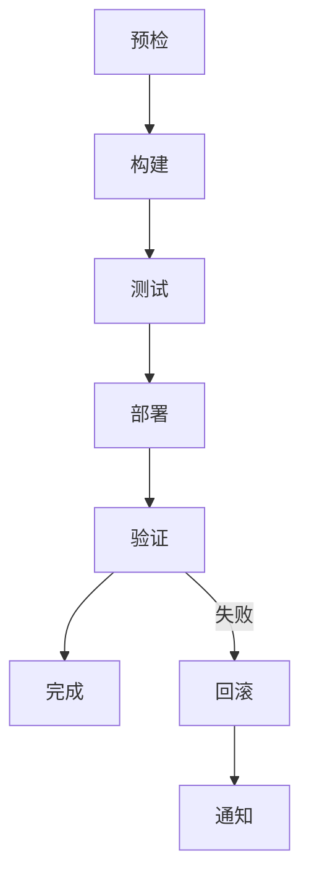

## 功能

编排完整的部署流程，分为以下阶段：

1. **预检阶段**：验证环境和依赖
2. **构建阶段**：编译代码、打包镜像
3. **测试阶段**：运行自动化测试
4. **部署阶段**：部署到目标环境
5. **验证阶段**：健康检查和烟雾测试
6. **完成阶段**：清理资源、发送通知

## 部署流程



## 参数

| 参数 | 类型 | 必需 | 说明 |
| ---- | ---- | ---- | ---- |
| environment | string | ✅ | 目标环境：dev / staging / production |
| version | string | ✅ | 部署版本号 |
| service | string | ✅ | 服务名称 |
| strategy | string | ❌ | 部署策略：rolling / blue-green / canary，默认 rolling |
| rollback_on_failure | boolean | ❌ | 失败时自动回滚，默认 true |
| dry_run | boolean | ❌ | 试运行模式，默认 false |

## 阶段详情

### 1. 预检阶段

检查项：

- [ ] 代码仓库状态（无未提交更改）
- [ ] 依赖版本兼容性
- [ ] 目标环境可用性
- [ ] 配置文件完整性
- [ ] 权限验证

### 2. 构建阶段

操作：

```bash
# 拉取代码
git pull origin main

# 安装依赖
npm install

# 运行构建
npm run build

# 构建 Docker 镜像
docker build -t $SERVICE:$VERSION .
```

### 3. 测试阶段

测试类型：

- 单元测试
- 集成测试
- E2E 测试（可选）
- 性能测试（可选）

### 4. 部署阶段

根据策略执行：

**滚动更新（Rolling）**：

```bash
kubectl set image deployment/$SERVICE $SERVICE=$IMAGE:$VERSION
kubectl rollout status deployment/$SERVICE
```

**蓝绿部署（Blue-Green）**：

```bash
# 部署到绿色环境
kubectl apply -f green-deployment.yaml
# 切换流量
kubectl patch service $SERVICE -p '{"spec":{"selector":{"version":"green"}}}'
```

**金丝雀发布（Canary）**：

```bash
# 部署金丝雀版本（10% 流量）
kubectl apply -f canary-deployment.yaml
# 监控指标
# 全量发布
kubectl apply -f production-deployment.yaml
```

### 5. 验证阶段

检查项：

- [ ] 健康检查端点响应
- [ ] 核心功能可用
- [ ] 日志无异常错误
- [ ] 性能指标正常
- [ ] 监控告警配置

### 6. 完成阶段

操作：

- 清理旧版本镜像
- 更新部署记录
- 发送部署通知（Slack/邮件）

## 回滚机制

自动回滚触发条件：

- 健康检查失败
- 错误率超过阈值
- 响应时间异常

回滚操作：

```bash
kubectl rollout undo deployment/$SERVICE
```

## 示例输出

```json
{
  "service": "user-api",
  "version": "2.1.0",
  "environment": "production",
  "strategy": "rolling",
  "stages": [
    {"name": "preflight", "status": "success", "duration": "10s"},
    {"name": "build", "status": "success", "duration": "2m"},
    {"name": "test", "status": "success", "duration": "5m"},
    {"name": "deploy", "status": "success", "duration": "1m"},
    {"name": "verify", "status": "success", "duration": "30s"}
  ],
  "total_duration": "8m40s",
  "rollback_available": true
}
```

## 适用场景

- 微服务部署
- 应用版本更新
- 环境配置变更
- 紧急热修复发布

## 不适用

- 数据库迁移（需要专门的迁移工具）
- 基础设施 provisioning（使用 Terraform/Pulumi）
- 长期运行的编排任务（使用 Airflow/Prefect）
