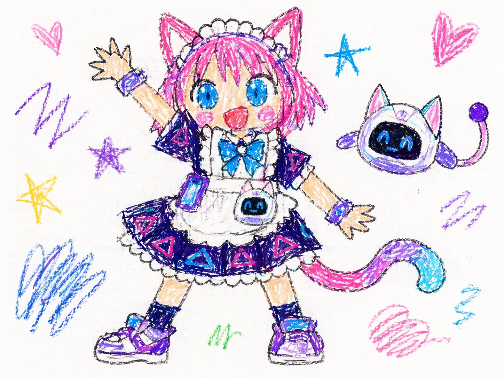
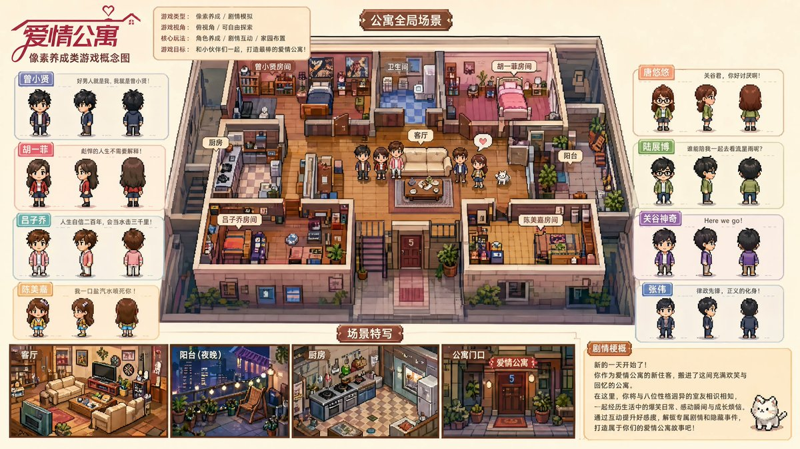

# GPT Image 2 Gen Skill

<p align="center">
  <strong>AI image generation with GPT Image 2, built for OpenClaw, Claude Code, OpenCode, and AI agents that need fast OpenAI-compatible image generation workflows.</strong>
</p>

<p align="center">
  <a href="https://docs.evolink.ai/en/api-manual/image-series/gpt-image-2/gpt-image-2-image-generation?utm_source=github&utm_medium=banner&utm_campaign=gpt-image-2-gen-skill">
    
  </a>
</p>

<p align="center">
  <a href="https://www.npmjs.com/package/evolink-gpt-image"></a>
  <a href="LICENSE"></a>
  <a href="https://github.com/EvoLinkAI/gpt-image-2-gen-skill/stargazers"></a>
  <a href="https://github.com/EvoLinkAI/gpt-image-2-gen-skill/commits/main/"></a>
</p>

<p align="center">
  <a href="#-menu">Menu</a> •
  <a href="#installation">Install</a> •
  <a href="#-showcase">Showcase</a> •
  <a href="#gpt-image-2-generation">GPT Image 2</a> •
  <a href="#getting-an-api-key">API Key</a> •
  <a href="https://evolink.ai/signup?utm_source=github&utm_medium=readme&utm_campaign=gpt-image-2-gen-skill">EvoLink</a>
</p>

<p align="center">
  <a href="README.md"></a>
  <a href="README.es.md"></a>
  <a href="README.pt.md"></a>
  <a href="README.ja.md"></a>
  <a href="README.ko.md"></a>
  <a href="README.de.md"></a>
  <a href="README.fr.md"></a>
  <a href="README.tr.md"></a>
  <a href="README.zh-TW.md"></a>
  <a href="README.zh-CN.md"></a>
  <a href="README.ru.md"></a>
</p>

---

> **AI Agent?** Skip the README, go straight to [**llms-install.md**](llms-install.md) for step-by-step installation instructions designed for you.

---

## 📑 Menu

- [What is This?](#what-is-this)
- [Installation](#installation)
- [Getting an API Key](#getting-an-api-key)
- [Showcase](#-showcase)
- [GPT Image 2 Generation](#gpt-image-2-generation)
- [File Structure](#file-structure)
- [Troubleshooting](#troubleshooting)
- [Compatibility](#compatibility)
- [License](#license)
- [Community](#community)

---

## What is This?

**GPT Image 2 Gen Skill** is an **AI agent image generation skill** for [OpenClaw](https://github.com/openclaw/openclaw), [Claude Code](https://github.com/anthropics/claude-code), and [OpenCode](https://github.com/opencode-ai/opencode), powered by [EvoLink](https://evolink.ai?utm_source=github&utm_medium=readme&utm_campaign=gpt-image-2-gen-skill). It gives your agent a fast **OpenAI-compatible API integration** for GPT Image 2, including text-to-image, image editing, batch generation, and multi-size output workflows.

| Skill | Description | Model |
|-------|-------------|-------|
| **GPT Image 2 Gen** | Text-to-image, image editing, batch generation | GPT Image 2 (OpenAI) |

---

## Installation

### Quick Install (OpenClaw)

```bash
openclaw skills add https://github.com/EvoLinkAI/gpt-image-2-gen-skill
```

### Install via npm (Recommended)

```bash
npx evolink-gpt-image
```

Or non-interactive (for AI agents / CI):

```bash
npx evolink-gpt-image -y
```

Install to a specific directory:

```bash
npx evolink-gpt-image -y --path ~/.claude/skills
```

### Manual Install

```bash
git clone https://github.com/EvoLinkAI/gpt-image-2-gen-skill.git
cd gpt-image-2-gen-skill
openclaw skills add .
```

### Agent Auto-Install (Copy & Paste to Your Agent)

Tell your AI agent the following prompt, and it will install the skill automatically:

#### Claude Code

```
Install the GPT Image 2 generation skill by running:

npx evolink-gpt-image@latest -y --path ~/.claude/skills

After installation, set the API key:

export EVOLINK_API_KEY=your_key_here

Then read the skill file at ~/.claude/skills/gpt-image-2-gen/SKILL.md to learn how to use it.
```

#### OpenCode

```
Install the GPT Image 2 generation skill by running:

npx evolink-gpt-image@latest -y --path ~/.opencode/skills

After installation, set the API key:

export EVOLINK_API_KEY=your_key_here

Then read the skill file at ~/.opencode/skills/gpt-image-2-gen/SKILL.md to learn how to use it.
```

#### OpenClaw

```
Install the GPT Image 2 generation skill by running:

npx evolink-gpt-image@latest -y

The installer will auto-detect your OpenClaw skills directory. After installation, set the API key:

export EVOLINK_API_KEY=your_key_here
```

#### One-Liner (Any Agent)

For agents that support shell commands, this single command installs and verifies in one step:

```bash
EVOLINK_API_KEY=your_key_here npx evolink-gpt-image@latest -y --path ~/.claude/skills
```

Replace `~/.claude/skills` with `~/.opencode/skills` or your agent's skill directory.

---

## Getting an API Key

1. Sign up at [evolink.ai](https://evolink.ai/signup?utm_source=github&utm_medium=readme&utm_campaign=gpt-image-2-gen-skill)
2. Go to Dashboard -> API Keys
3. Create a new key
4. Set it in your environment:

```bash
export EVOLINK_API_KEY=your_key_here
```

Or tell your AI agent: *"Set my EvoLink API key to ..."* — it will handle the rest.

---

## 🖼️ Showcase

| Portrait Styling | Product Marketing | Character Design |
|---|---|---|
|  |  |  |

> These examples were selected from the [awesome-gpt-image-2-prompts](https://github.com/EvoLinkAI/awesome-gpt-image-2-prompts) repository. Install the skill, connect your EvoLink API key, and use the [GPT Image 2 image generation docs](https://docs.evolink.ai/en/api-manual/image-series/gpt-image-2/gpt-image-2-image-generation?utm_source=github&utm_medium=readme&utm_campaign=gpt-image-2-gen-skill) to create similar outputs.

---

## GPT Image 2 Generation

Generate and edit AI images through natural conversation with your AI agent.

### What It Can Do

- **Text-to-image** — Describe what you want, get an image
- **Image editing** — Provide reference images (1-16) and describe edits
- **Batch generation** — Generate up to 10 images per request
- **Multiple sizes** — 15 ratio presets + custom pixel dimensions
- **Resolution tiers** — 1K (~1MP), 2K (~4MP), 4K (~8.3MP)
- **Quality levels** — Low (fast), Medium (balanced), High (best)
- **Prompt power** — Up to 32,000 characters per prompt

### Usage Examples

Just talk to your agent:

> "Generate an image of a sunset over the ocean"

> "Create a minimalist logo, 1024x1024, high quality"

> "Edit this image — add a cat next to the person"

> "Generate 4 variations of a pixel art robot in 4K"

The agent will guide you through any missing details and handle the generation.

### Requirements

- `curl` and `jq` installed on your system
- `EVOLINK_API_KEY` environment variable set

### Script Reference

The skill includes `scripts/gpt-image-gen.sh` for direct command-line use:

```bash
# Text-to-image (basic)
./scripts/gpt-image-gen.sh "A beautiful sunset over the ocean"

# High quality 4K widescreen
./scripts/gpt-image-gen.sh "Cinematic cityscape at dusk" --size 16:9 --resolution 4K --quality high

# Custom pixel dimensions
./scripts/gpt-image-gen.sh "Minimalist logo" --size 1024x1024

# Image editing
./scripts/gpt-image-gen.sh "Add a cat next to her" --image "https://example.com/photo.png"

# Batch generation
./scripts/gpt-image-gen.sh "Pixel art robot" --count 4 --quality high

# Dry run (preview payload)
./scripts/gpt-image-gen.sh "Test prompt" --dry-run
```

### API Parameters

See [references/api-params.md](references/api-params.md) for complete API documentation.

---

## File Structure

```
.
├── README.md                    # This file
├── SKILL.md                     # Skill definition (for AI agents)
├── _meta.json                   # Skill metadata
├── bin/
│   └── cli.js                   # npm installer CLI
├── references/
│   └── api-params.md            # Complete API parameter reference
└── scripts/
    └── gpt-image-gen.sh         # Image generation script
```

---

## Troubleshooting

| Issue | Solution |
|-------|---------|
| `jq: command not found` | Install jq: `apt install jq` / `brew install jq` |
| `401 Unauthorized` | Check your `EVOLINK_API_KEY` at [evolink.ai/dashboard](https://evolink.ai/dashboard?utm_source=github&utm_medium=readme&utm_campaign=gpt-image-2-gen-skill) |
| `402 Payment Required` | Add credits at [evolink.ai/dashboard](https://evolink.ai/dashboard?utm_source=github&utm_medium=readme&utm_campaign=gpt-image-2-gen-skill) |
| `Content blocked` | Prompt flagged by moderation — modify your description |
| Image too large | Reference images must be <=50MB each |
| Generation timeout | Images can take 5-90s. Try lower quality/resolution first. |

---

## Compatibility

| Agent | Install Method |
|-------|---------------|
| **OpenClaw** | `openclaw skills add <repo>` or `npx evolink-gpt-image` |
| **Claude Code** | `npx evolink-gpt-image -y --path ~/.claude/skills` |
| **OpenCode** | `npx evolink-gpt-image -y --path ~/.opencode/skills` |
| **Cursor** | `npx evolink-gpt-image -y --path <your-skills-dir>` |

---

## License

MIT

---

## Community

- Docs: [GPT Image 2 image generation manual](https://docs.evolink.ai/en/api-manual/image-series/gpt-image-2/gpt-image-2-image-generation?utm_source=github&utm_medium=readme&utm_campaign=gpt-image-2-gen-skill)
- EvoLink: [Create an API key](https://evolink.ai/signup?utm_source=github&utm_medium=readme&utm_campaign=gpt-image-2-gen-skill)
- Workflow repo: [GPT-Image-2 × Seedance 2.0](https://github.com/EvoLinkAI/GPT-Image-2-Seedance2-Workflow)
- Follow EvoLinkAI: [x.com/EvoLinkAI](https://x.com/EvoLinkAI)

## Star History

[](https://www.star-history.com/#EvoLinkAI/gpt-image-2-gen-skill&Date)

---

<p align="center">
  Powered by <a href="https://evolink.ai/signup?utm_source=github&utm_medium=readme&utm_campaign=gpt-image-2-gen-skill"><strong>EvoLink</strong></a> , Unified AI API Gateway
</p>
