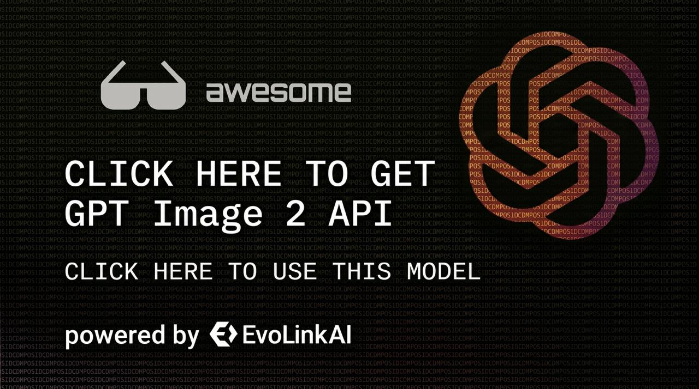

# GPT Image 2 Gen Skill

<p align="center">
  <strong>GPT Image 2 ile AI görsel oluşturma — tek komutla kur, saniyeler içinde oluşturmaya başla.</strong>
</p>

<p align="center">
  <a href="#gpt-image-2-görsel-oluşturma">GPT Image 2</a> •
  <a href="#kurulum">Kurulum</a> •
  <a href="#api-key-alma">API Key</a> •
  <a href="https://evolink.ai/signup?utm_source=github&utm_medium=readme&utm_campaign=gpt-image-2-gen-skill">EvoLink</a>
</p>

<p align="center">
  <strong>Languages:</strong>
  <a href="README.md">English</a> |
  <a href="README.es.md">Español</a> |
  <a href="README.pt.md">Português</a> |
  <a href="README.ja.md">日本語</a> |
  <a href="README.ko.md">한국어</a> |
  <a href="README.de.md">Deutsch</a> |
  <a href="README.fr.md">Français</a> |
  <a href="README.tr.md">Türkçe</a> |
  <a href="README.zh-TW.md">繁體中文</a> |
  <a href="README.zh-CN.md">简体中文</a> |
  <a href="README.ru.md">Русский</a>
</p>

<p align="center">
  <a href="https://docs.evolink.ai/en/api-manual/image-series/gpt-image-2/gpt-image-2-image-generation?utm_source=github&utm_medium=banner&utm_campaign=gpt-image-2-gen-skill">
    
  </a>
</p>

---

> **AI Agent misiniz?** README'yi atlayın — doğrudan [**llms-install.md**](llms-install.md) dosyasına gidin. AI Agent'lar için tasarlanmış adım adım kurulum talimatları orada.

---

## Bu nedir?

[OpenClaw](https://github.com/openclaw/openclaw) / [Claude Code](https://github.com/anthropics/claude-code) / [OpenCode](https://github.com/opencode-ai/opencode) için [EvoLink](https://evolink.ai?utm_source=github&utm_medium=readme&utm_campaign=gpt-image-2-gen-skill) tarafından desteklenen bir skill. Skill'i kurun ve AI agent'ınız GPT Image 2 kullanarak görsel oluşturma ve düzenleme yeteneği kazansın.

| Skill | Açıklama | Model |
|-------|----------|-------|
| **GPT Image 2 Gen** | Metinden görsele, görsel düzenleme, toplu oluşturma | GPT Image 2 (OpenAI) |

---

## Kurulum

### Hızlı Kurulum (OpenClaw)

```bash
openclaw skills add https://github.com/EvoLinkAI/gpt-image-2-gen-skill
```

### npm ile Kurulum (Önerilen)

```bash
npx evolink-gpt-image
```

Etkileşimsiz mod (AI agent'lar / CI için):

```bash
npx evolink-gpt-image -y
```

Belirli bir dizine kurulum:

```bash
npx evolink-gpt-image -y --path ~/.claude/skills
```

### Manuel Kurulum

```bash
git clone https://github.com/EvoLinkAI/gpt-image-2-gen-skill.git
cd gpt-image-2-gen-skill
openclaw skills add .
```

---

## API Key Alma

1. [evolink.ai](https://evolink.ai/signup?utm_source=github&utm_medium=readme&utm_campaign=gpt-image-2-gen-skill) adresinden kaydolun
2. Dashboard -> API Keys bölümüne gidin
3. Yeni bir anahtar oluşturun
4. Ortam değişkenini ayarlayın:

```bash
export EVOLINK_API_KEY=your_key_here
```

---

## GPT Image 2 Görsel Oluşturma

AI agent'ınızla doğal konuşma yoluyla AI görselleri oluşturun ve düzenleyin.

### Özellikler

- **Metinden görsele** — Ne istediğinizi tanımlayın, bir görsel alın
- **Görsel düzenleme** — Referans görseller (1-16) sağlayın ve düzenlemeleri tanımlayın
- **Toplu oluşturma** — İstek başına 10'a kadar görsel oluşturun
- **Çoklu boyutlar** — 15 oran ön ayarı + özel piksel boyutları
- **Çözünürlük seviyeleri** — 1K (~1MP), 2K (~4MP), 4K (~8,3MP)
- **Kalite seviyeleri** — Low (hızlı), Medium (dengeli), High (en iyi)
- **Güçlü prompt'lar** — Prompt başına 32.000 karaktere kadar

### Kullanım Örnekleri

Agent'ınızla konuşmanız yeterli:

> "Okyanus üzerinde bir gün batımı görseli oluştur"

> "Minimalist bir logo oluştur, 1024x1024, yüksek kalite"

> "Bu görseli düzenle — kişinin yanına bir kedi ekle"

> "4K'da piksel sanatı robot'un 4 varyasyonunu oluştur"

### Gereksinimler

- Sisteminizde `curl` ve `jq` kurulu olmalı
- `EVOLINK_API_KEY` ortam değişkeni ayarlanmış olmalı

### Script Referansı

```bash
# Metinden görsele (temel)
./scripts/gpt-image-gen.sh "Okyanus üzerinde güzel bir gün batımı"

# Yüksek kalite 4K geniş ekran
./scripts/gpt-image-gen.sh "Alacakaranlıkta sinematik şehir manzarası" --size 16:9 --resolution 4K --quality high

# Özel piksel boyutları
./scripts/gpt-image-gen.sh "Minimalist logo" --size 1024x1024

# Görsel düzenleme
./scripts/gpt-image-gen.sh "Yanına bir kedi ekle" --image "https://example.com/photo.png"

# Toplu oluşturma
./scripts/gpt-image-gen.sh "Piksel sanatı robot" --count 4 --quality high

# Test çalıştırma (payload önizleme)
./scripts/gpt-image-gen.sh "Test prompt'u" --dry-run
```

### API Parametreleri

Tam API dokümantasyonu için [references/api-params.md](references/api-params.md) dosyasına bakın.

---

## Dosya Yapısı

```
.
├── README.md                    # İngilizce dokümantasyon
├── SKILL.md                     # Skill tanımı (AI agent'lar için)
├── _meta.json                   # Skill meta verileri
├── bin/
│   └── cli.js                   # npm yükleyici CLI
├── references/
│   └── api-params.md            # Tam API parametre referansı
└── scripts/
    └── gpt-image-gen.sh         # Görsel oluşturma script'i
```

---

## Sorun Giderme

| Sorun | Çözüm |
|-------|-------|
| `jq: command not found` | jq kurun: `apt install jq` / `brew install jq` |
| `401 Unauthorized` | `EVOLINK_API_KEY` kontrol edin: [evolink.ai/dashboard](https://evolink.ai/dashboard?utm_source=github&utm_medium=readme&utm_campaign=gpt-image-2-gen-skill) |
| `402 Payment Required` | Kredi ekleyin: [evolink.ai/dashboard](https://evolink.ai/dashboard?utm_source=github&utm_medium=readme&utm_campaign=gpt-image-2-gen-skill) |
| İçerik engellendi | Prompt moderasyon tarafından işaretlendi — açıklamanızı değiştirin |
| Görsel çok büyük | Referans görseller her biri <=50MB olmalı |
| Oluşturma zaman aşımı | Görseller 5-90s sürebilir. Önce düşük kalite/çözünürlük deneyin. |

---

## Uyumluluk

| Agent | Kurulum Yöntemi |
|-------|----------------|
| **OpenClaw** | `openclaw skills add <repo>` veya `npx evolink-gpt-image` |
| **Claude Code** | `npx evolink-gpt-image -y --path ~/.claude/skills` |
| **OpenCode** | `npx evolink-gpt-image -y --path ~/.opencode/skills` |
| **Cursor** | `npx evolink-gpt-image -y --path <skills-dizininiz>` |

---

## Lisans

MIT

---

<p align="center">
  Powered by <a href="https://evolink.ai/signup?utm_source=github&utm_medium=readme&utm_campaign=gpt-image-2-gen-skill"><strong>EvoLink</strong></a> — Unified AI API Gateway
</p>
